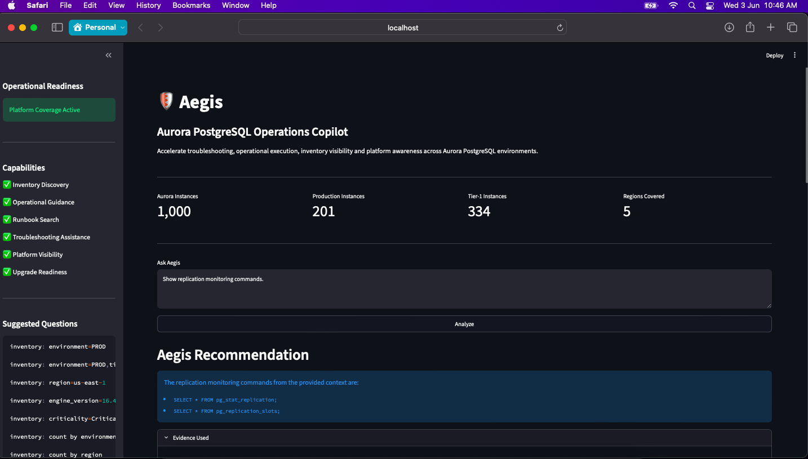

# DBA AI Assistant

# DBA AI Assistant

AI-powered Aurora PostgreSQL assistant using:

- Ollama
- Qwen 2.5
- ChromaDB
- Nomic Embeddings
- Streamlit

## Features

- Aurora PostgreSQL troubleshooting
- SQL knowledge search
- Inventory lookup
- RAG architecture

## Tech Stack

- Python
- Ollama
- ChromaDB
- Streamlit

## Installation

git clone ...

python -m venv venv

source venv/bin/activate

pip install -r requirements.txt

ollama pull qwen2.5:7b
ollama pull nomic-embed-text

python ingest.py

streamlit run app.py

## Screenshots

## Disclaimer

This project provides AI-generated recommendations.

Always validate SQL statements, maintenance actions, and operational guidance before executing in production environments.
